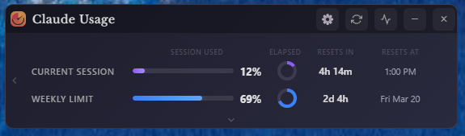
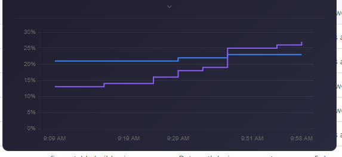

# Claude Usage Widget

A beautiful, standalone desktop widget for **Windows, macOS, and Linux** that displays your Claude.ai usage statistics in real-time.



---

## Features

🎯 **Real-time Usage Tracking** — Monitor both session and weekly usage limits  
📊 **Visual Progress Bars** — Clean, gradient progress indicators with configurable warning thresholds  
⏱️ **Countdown Timers** — Circular timers showing time elapsed in the current session window  
🔄 **Auto-refresh** — Updates every 5 minutes automatically, with animated refresh indicator  
📈 **Usage History Graph** — Toggleable 7-day chart showing session and weekly trends over time  
🌍 **Currency Support** — Extra usage displays your account's billing currency (€, £, $)  
🎨 **Modern UI** — Sleek, draggable widget with dark and light themes  
🔒 **Secure** — Encrypted credential storage  
📍 **Always on Top** — User-controlled, stays visible across all workspaces  
💾 **System Tray** — Minimizes to tray for easy access  
⚙️ **Settings Panel** — Persistent preferences for startup, theme, tray, thresholds, and date/time formats  
🔔 **Usage Alerts** — Desktop notifications when usage crosses configurable warn/danger thresholds  
🔔 **Update Notifications** — Automatic check for new releases on startup  
🕐 **Configurable Date & Time Formats** — 12h/24h time, and flexible weekly reset date display  
📐 **Compact Mode** — Minimal view for when you just need a quick glance  

---

## What's New in v1.7.0

### 🎨 Dynamic Threshold Colors

All usage bars (Session, Weekly, and Extra Usage) now respect your configured warning and danger thresholds:
- **Green** below warning threshold
- **Amber** at or above warning threshold
- **Red** at or above danger threshold

Changes apply immediately when thresholds are adjusted in Settings.

### 📈 Usage History Graph

A toggleable usage history graph now sits below the main widget. Click the graph button in the toolbar to show or hide it.



- Displays up to **7 days** of collected usage data points
- **Data points are captured each time the app refreshes** (every 5 minutes by default when running)
- History **persists across restarts** — collected data is retained when you close and reopen the app
- Sonnet and Extra Usage lines appear automatically when those sections are relevant
- **Adaptive x-axis labels** — shows times for short spans, weekday+hour for medium spans, and dates for longer spans
- Respects your **12h/24h time format** setting
- Hover tooltip shows exact timestamp and value

> **Note:** The graph shows usage snapshots captured at each refresh interval while the app is running. Time periods when the app is closed are not represented on the graph.

### 🌍 Currency Support
The Extra Usage row now displays the correct currency symbol based on your account's billing currency — **€**, **£**, or **$**.

> For full release history, see the [Releases](../../releases) page.

---

## Screenshots

### Settings Panel


### Settings Options

- ⚙️ **Launch at startup** — Auto-start with Windows or macOS login
- 📌 **Hide from taskbar** — Tray-only mode
- 🎨 **Theme selector** — Dark / Light / System
- ⚠️ **Warning thresholds** — Configurable amber and red levels for usage bars
- 🔔 **Usage alerts** — Desktop notifications at warn/danger thresholds
- 🕐 **Time format** — 12h or 24h
- 📅 **Date format** — Controls how the weekly reset date is displayed
- 📐 **Compact mode** — Minimal two-bar view

---

## Installation

### Download Pre-built Release

**Windows:**
1. Download the latest `Claude-Usage-Widget-{version}-win-Setup.exe` (installer) or `Claude-Usage-Widget-{version}-win-portable.exe` (no install needed) from [Releases](../../releases)
2. Run the installer or portable exe
3. Launch "Claude Usage Widget" from the Start Menu (installer) or directly (portable)
4. **To launch at Windows startup (portable only):** Press `Win+R`, type `shell:startup`, and copy the portable `.exe` into that folder. To update, copy the new version in and delete the old one.

**macOS:**
1. Download the latest `Claude-Usage-Widget-{version}-macOS-arm64.dmg` (Apple Silicon) or `Claude-Usage-Widget-{version}-macOS-x64.dmg` (Intel) from [Releases](../../releases)
2. Open the DMG and drag the app to your Applications folder
3. Launch "Claude Usage Widget" from Applications

> **⚠️ macOS Security Notice:** Because this app is not yet notarized with Apple, macOS Gatekeeper may show a "damaged or can't be opened" warning. To fix this, run the following command in Terminal after installing:
> ```
> xattr -cr /Applications/Claude\ Usage\ Widget.app
> ```
> Then try launching the app again.

**Linux:**
1. Download the latest `Claude-Usage-Widget-{version}-linux-x86_64.AppImage` (Intel/AMD) or `Claude-Usage-Widget-{version}-linux-arm64.AppImage` (ARM) from [Releases](../../releases)
2. Make it executable: `chmod +x Claude-Usage-Widget-*.AppImage`
3. Run it: `./Claude-Usage-Widget-*.AppImage`

> **Note:** AppImage runs without installation on most Linux distributions. On Ubuntu 22.04+, you may need to install a dependency first:
> ```bash
> sudo apt install libfuse2
> ```

#### Linux: Desktop Launcher & Autostart (optional)

By default the AppImage runs from wherever you put it. To get a clickable icon in your app launcher (and optionally launch at login), follow these steps.

**1. Place the AppImage somewhere permanent:**
```bash
mkdir -p ~/.local/bin
mv Claude-Usage-Widget-*.AppImage ~/.local/bin/claude-usage-widget.AppImage
chmod +x ~/.local/bin/claude-usage-widget.AppImage
```

**2. Create a desktop entry:**
```bash
cat > ~/.local/share/applications/claude-usage-widget.desktop << EOF
[Desktop Entry]
Name=Claude Usage Widget
Comment=Monitor Claude.ai usage
Exec=$HOME/.local/bin/claude-usage-widget.AppImage --no-sandbox
Icon=$HOME/.local/bin/claude-usage-widget.AppImage
Terminal=false
Type=Application
Categories=Utility;
StartupNotify=true
EOF
```

> **Note:** The `--no-sandbox` flag is required for Electron-based AppImages on most Linux systems due to sandbox namespace restrictions. This is an Electron/Chrome limitation, not specific to this widget.

**3. Register the entry:**
```bash
update-desktop-database ~/.local/share/applications/
```

The widget should now appear in your application launcher. Test it by launching from your app menu before proceeding to autostart.

**4. Autostart at login (optional):**
```bash
mkdir -p ~/.config/autostart
cp ~/.local/share/applications/claude-usage-widget.desktop ~/.config/autostart/
```

---

### Build from Source

**Prerequisites:**
- Node.js 18+ ([Download](https://nodejs.org))
- npm (comes with Node.js)

```bash
git clone https://github.com/SlavomirDurej/claude-usage-widget.git
cd claude-usage-widget
npm install
npm start
```


---

## Usage

### First Launch

1. Launch the widget
2. Click "Login to Claude" when prompted
3. A browser window will open — log in to your Claude.ai account
4. The widget will automatically capture your session
5. Usage data will start displaying immediately

### Widget Controls

- **Drag** — Click and drag the title bar to move the widget
- **Refresh** — Click the refresh icon to update data immediately
- **Graph** — Click the graph icon to toggle usage history
- **Minimize** — Click the minus icon to hide to system tray / dock
- **Close** — Click the X to Close the app

### System Tray

Right-click the tray icon for: Show/Hide, Refresh, Re-login, Settings, Exit.

---

## Understanding the Display

### Current Session & Weekly Limit

| Column | Description |
|--------|-------------|
| Session Used | Progress bar showing usage from 0–100% |
| Elapsed | Circular timer showing how far through the window you are |
| Resets In | Countdown until the window resets |
| Resets At | Actual local clock time / date when the window resets |

**Color Coding:**
- 🟣 Purple: Normal usage (below warning threshold, default 75%)
- 🟠 Orange: High usage (above warning threshold)
- 🔴 Red: Critical usage (above danger threshold, default 90%)

---

## Privacy & Security

- Credentials stored **locally only** using encrypted storage
- No data sent to any third-party servers
- Only communicates with the official Claude.ai API
- Logout clears all session data, cookies, and Electron session storage

---

## Troubleshooting

**"Login Required" keeps appearing** — Session may have expired. Click "Login to Claude" to re-authenticate.

**Widget not updating** — Check internet connection, click refresh manually, or try re-logging in from the tray menu.

**Build errors** — Clean reinstall resolves most issues:
```bash
rm -rf node_modules package-lock.json
npm install
```

If issues persist, open a [Support discussion](../../discussions/categories/support) with your OS, Node.js version, and full error output.

---

## Roadmap

- [x] macOS support
- [x] Linux support
- [x] Settings panel
- [x] Remember window position
- [x] Custom warning thresholds
- [x] Configurable date & time formats
- [x] Update notifications
- [x] Usage alerts at thresholds
- [x] Compact mode
- [x] Usage history graph
- [x] Currency support
- [x] Organization/Teams support
- [ ] Keyboard shortcuts

---

## Contributors

Special thanks to these contributors who have improved the widget:

- [@cwil2072](https://github.com/cwil2072) - macOS minimize/restore fix, usage history graph
- [@dion-jy](https://github.com/dion-jy) - Login flow architecture improvements
- [@goooseman](https://github.com/goooseman) - Login window security improvements
- [@sergkuzn](https://github.com/sergkuzn) - Linux desktop launcher & autostart documentation

---

## License

This project is licensed under the [MIT License](LICENSE) - see the LICENSE file for details.

---

*Built with Electron · [Releases](../../releases) · [Discussions](../../discussions)*
